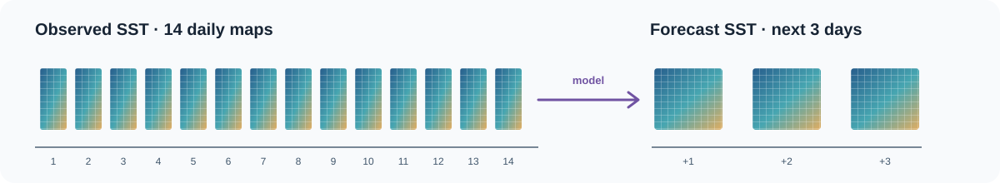

# Ocean SST Forecasting

**A teaching repository for EGR 444 at the University of Rhode Island.** Given 14 daily sea-surface temperature (SST) maps around the Florida Keys, students are tasked to predict the next 3 maps using a host of models (spatial, temporal, and spatio-temporal). The project uses a fixed forecasting task to compare what different model families learn from space, time, and their combination.



The timeline above is a schematic of the input and output shapes, not measured SST maps. The actual competition grid and Florida coastline are shown in the [region graphic below](#forecasting-task-and-evaluation).

## Why this repository exists

This is my **reference implementation** for the course competition, released in stages. Each week, students will be taught a model family, implement and test their own approach, and submit predictions to [Kaggle](https://www.kaggle.com/competitions/egr444-ocean-forecasting-competition). (Note: The Kaggle competition is currently set to private, but will be opened up to the public at the conclusion of the semester.)

**After each week's submission checkpoint**, I publish a deliberately small implementation showing how I approached the task. Students can then compare design choices, inspect the training workflow, and decide what to try next. The reference code is a learning aid, not a *required* architecture.

Currently, the progression starts with persistence, then a small CNN, a plain RNN, and an LSTM. The lesson is an experimental one: a more complex model is not automatically a better forecast. In particular, a CNN can use local spatial structure but treats input days as channels here; the RNN and LSTM process days in order but flatten each map, so neighboring grid cells are not explicitly represented as neighbors. That tradeoff motivates later models that represent space and time together. The repository also demonstrates reproducible configurations, a fixed validation metric, saved checkpoints, and optional experiment tracking.

For readers outside the course: the prepared `.npz` files are **not in this repository**. If you would like to follow the same exercise, [contact me through my GitHub profile (@mchiovaro)](https://github.com/mchiovaro) or my university email, **mchiovaro@uri.edu** to request the prepared data. The underlying source is [NOAA OISST v2.1](https://www.ncei.noaa.gov/products/optimum-interpolation-sst) ([dataset DOI](https://doi.org/10.25921/RE9P-PT57)).

## Forecasting task and evaluation

Each example is a sliding window: observed days 1–14 become the input, and observed days 15–17 are the target. Every map has the same latitude–longitude grid. The prepared region spans **23.5–26.5°N, 83.0–79.5°W**, covering the Florida Keys and nearby Gulf and Atlantic waters. SST is measured in degrees Celsius. The stored coordinates are cell centers: 23.625–26.375°N and 277.125–280.375°E (82.875–79.625°W). Longitudes in the files use the 0–360° convention.

| Item | Shape or definition |
| --- | --- |
| Inputs `X` | `(examples, 14, latitude, longitude)` |
| Targets `y` | `(examples, 3, latitude, longitude)` |
| `mask` | Grid cells counted as ocean for scoring |
| Persistence baseline | Repeat day 14 for forecast days +1, +2, and +3 |
| Score | RMSE over all examples and scored ocean cells for each lead day, then the mean of the three RMSE values; lower is better |

The stored example dates are grouped chronologically: **1998–2021** for training, **2022–2023** for validation, and **2024–2025** for test. The data-preparation code is not included, so these labels alone do not verify which day of each window `dates` represents or the exact target boundaries. Inputs can legitimately include observations from before their target period. Normalization statistics for learned models are calculated from training inputs only.

These maps are a compact example of **spatiotemporal prediction**: the model receives an evolving field and must estimate future fields, rather than assigning a label to a single image. The same modeling questions about temporal context, spatial structure, held-out periods, and useful baselines arise in other environmental sensing problems.

## Start here

Use **Python 3.12** and run commands from the repository root. Put these three instructor-provided files directly in `data/`:

| File | Arrays | Purpose |
| --- | --- | --- |
| `data/train.npz` | `X`, `y`, `dates`, `lat`, `lon`, `mask` | Fit models |
| `data/validation.npz` | Same fields | Compare runs and choose a checkpoint |
| `data/test_inputs.npz` | `X`, `dates`, `lat`, `lon`, `mask` | Make Kaggle predictions; no targets |

**One sample** is a 14-day input window and its 3-day target window. Training examples update learned weights; validation targets are used for model comparison and checkpoint selection; hidden test targets are used for competition scoring. Land cells are excluded from the metric implemented in `src/evaluate.py`.

Colab or a local computer is enough for the baseline and small models; HPC is optional. In Colab, use a Python 3.12 runtime, open `notebooks/competition_quickstart.ipynb`, set `REPO_DIR`, and run the cells in order.

For macOS or Linux:

```bash
python3.12 -m venv .venv
source .venv/bin/activate
python -m pip install -r requirements.txt
```

On Windows, run `py -3.12 -m venv .venv`, activate with `.venv\Scripts\Activate.ps1`, then install with `python -m pip install -r requirements.txt`. The commands below use `python` after activation.

Check the data and basic workflow:

```bash
python scripts/check_data.py
python -m unittest discover -s tests
python -m src.train --config configs/baseline.yaml
```

The test command runs the tests available in this checkout. Additional local tests are Git-ignored, so a fresh clone currently includes only `tests/test_dataset.py`.

The baseline repeats the last observed map and writes its validation score to `outputs/baseline/metrics.json`. Passing the setup checks means the pipeline runs; it does not mean a learned model has beaten persistence.

Create a baseline Kaggle submission:

```bash
python -m src.predict --input data/test_inputs.npz --output outputs/test_predictions.npz
python submission/make_submission.py --predictions outputs/test_predictions.npz --output outputs/submission.csv
```

Submission rows preserve input-example order, then lead day (1–3), latitude index, and longitude index. See [data notes](docs/data.md) for indices, masks, and submission IDs, and the [workflow walkthrough](docs/walkthrough.md) for files, commands, and saved results.

## Released model examples

The reference examples below are available **after their corresponding student checkpoint**. Use the same prepared splits and metric when comparing them, and record the configuration, validation score, Kaggle submission, and what you learned. A model may be a sound experiment even when it does not beat persistence.

| Model | What it adds | Key limitation in this implementation | Config |
| --- | --- | --- | --- |
| Persistence | A no-training benchmark | Assumes no change over the forecast horizon | `configs/baseline.yaml` |
| Small CNN | Learns local spatial corrections to persistence | Treats the 14 input days as channels | `configs/small_cnn.yaml` |
| RNN | Processes the 14 days in order | Flattens each map before the recurrent layer | `configs/rnn.yaml` |
| LSTM | Carries a hidden state and cell state through the sequence | Also flattens each map | `configs/lstm.yaml` |

Train a released learned model by choosing its config:

```bash
python -m src.train --config configs/small_cnn.yaml
python -m src.train --config configs/rnn.yaml
python -m src.train --config configs/lstm.yaml
```

Each command **starts from scratch**. The included learned-model configs currently use 10 epochs and the same starting training settings. `hidden_channels` controls CNN width; in the RNN and LSTM configs, it sets the recurrent `hidden_size`. The recurrent examples use the fixed **12 × 14** grid. For a one-epoch smoke check, copy a config, set `epochs: 1`, and choose a new `output_dir`.

Learned runs save `history.json` after each epoch, `metrics.json` with the best validation score and epoch, `config.yaml`, and `best_model.pt` in their output folder. The training script minimizes pooled ocean-cell MSE. Its logged training RMSE therefore differs from the validation score, which computes RMSE separately for each forecast day and then averages the three. Both scores are in °C; compare **validation RMSE** with `outputs/baseline/metrics.json`.

For example, create a submission from the CNN checkpoint:

```bash
python -m src.predict \
  --input data/test_inputs.npz \
  --checkpoint outputs/small_cnn/best_model.pt \
  --output outputs/small_cnn_test_predictions.npz
python submission/make_submission.py \
  --predictions outputs/small_cnn_test_predictions.npz \
  --output outputs/small_cnn_submission.csv
```

Without `--checkpoint`, `src.predict` uses persistence. A checkpoint includes the model type and settings, weights, and training normalization; `src/model.py` rebuilds the architecture when loading it. `--device auto` uses CUDA if available and otherwise uses the CPU. Reusing an output folder overwrites results: copy the config and change `output_dir` for a separate experiment, or use `--track` for a unique run folder. The [model comparison notes](docs/comparing-models.md) explain what a score difference can and cannot tell us.

## Optional experiment tracking

MLflow is optional. With `--track`, each run gets its own output subfolder and a local record of settings, learning curves, and checkpoints. For prediction, use the checkpoint inside the printed run folder, such as `outputs/lstm/<run-id>/best_model.pt`, rather than the untracked path above.

```bash
python -m pip install -r requirements-tracking.txt
python -m src.train --config configs/lstm.yaml --track
python -m mlflow server --backend-store-uri sqlite:///outputs/mlflow/mlflow.db --host 127.0.0.1 --port 5001
```

Open [http://127.0.0.1:5001](http://127.0.0.1:5001) and select **ocean-sst**. On Windows, run the same `python -m mlflow server` command in the activated environment. See [experiment tracking notes](docs/experiments.md).

## Project map

| Path | Purpose |
| --- | --- |
| `src/dataset.py`, `scripts/check_data.py` | Load and validate prepared arrays and the shared grid |
| `src/model.py` | Released reference model implementations |
| `src/evaluate.py` | Masked ocean-cell RMSE |
| `src/train.py`, `src/predict.py` | Baseline/learned training and test predictions |
| `src/tracking.py`, `configs/` | Optional run tracking and reproducible settings |
| `notebooks/competition_quickstart.ipynb` | Colab path |
| `submission/make_submission.py` | Convert predictions to Kaggle CSV |
| `tests/`, `docs/` | Checks and detailed notes |

The data files, generated outputs, and private test targets do not belong in Git. Additional lessons and example code are released as the class progresses.
